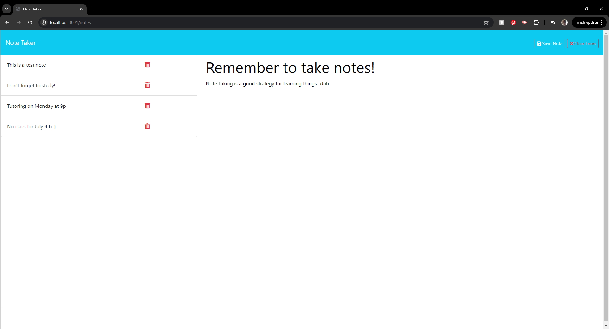

# Donna's Note Taker App

## Overview

**Donna's Note Take App** is a simple web application that allows users to create, store, view, and delete notes!

## Technologies Used

-HTML5 
-CSS3 
-JavaScript (ES6) 
-Express.js 
-Node.js

## Usage

From the main page, click "Get Started". You'll be directed to the note-taking page, where you will enter a **Note Title** and your **Note Text**. Click **Save Note** at the top right. Changed your mind? Simply **Clear Note**. View and/or delete your previously entered notes on the left side of the page.

## License

This app is licensed with the Unlicense. Please refer to the Unlicense documentation for more information.

## Contributions

Contributions are welcome! If you have suggestions for improvements or want to report bugs, please open an issue or submit a pull request.

## Contact

For questions, please contact Donna Burns: [Github](https://github.com/donnacancode)
